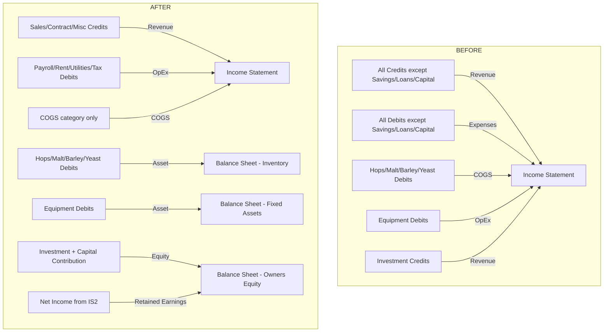
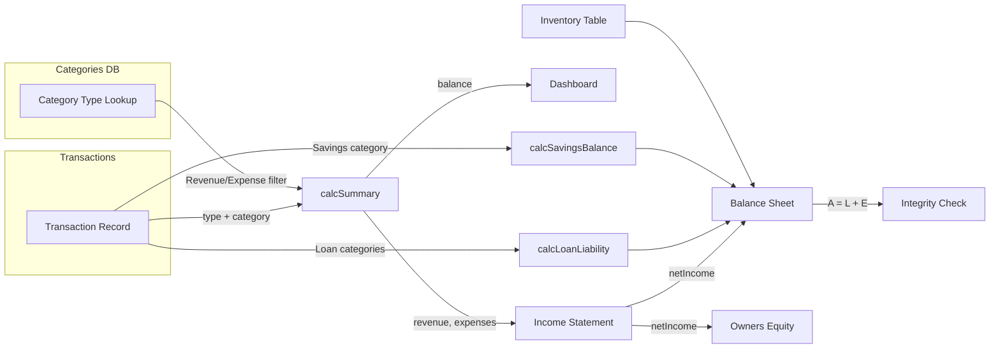

# Accounting Logic Rewrite Plan

## Executive Summary
Rewrite the financial logic in `calcSummary`, the Reports page, and the transaction handler to comply with GAAP-aligned accounting rules for the Green Bastards Brewery app. Five rules must be enforced:

1. **Equity vs. Revenue** — Investment & Capital Contribution are Owner's Equity, not Revenue
2. **Double-Entry Loan Logic** — Loan Proceeds increase Cash AND Liability simultaneously
3. **Accrual Inventory** — Raw material purchases are Assets, not COGS, until a sale occurs
4. **No Depreciation** — Equipment is never depreciated
5. **Balance Sheet Integrity** — Assets = Liabilities + Equity must always hold

Important Note: Hops/Malt/Barley/Yeast Need to be removed. They do not exist and should be deleted from everything.

---

## Current Bugs Found

### Bug 1: Investment Classified as Revenue
- **DB:** `categories` table has `Investment` with `type='Revenue'` ([initial_schema.sql](supabase/migrations/20260223080216_initial_schema.sql:33))
- **calcSummary:** `excludedCats` on [line 49](src/App.jsx:49) does NOT include `Investment`, so it flows into operating revenue
- **Income Statement:** [Line 811](src/App.jsx:811) explicitly renders `Investment / Other Income` as a revenue line item
- **Balance Sheet:** [Line 845](src/App.jsx:845) only counts `Capital Contribution` in `capitalContributions`, missing `Investment`
- **Impact:** Revenue is overstated; Owner's Equity is understated

### Bug 2: Raw Materials Expensed Immediately
- **DB:** `Hops`, `Malt`, `Barley`, `Yeast` all have `type='Expense'` ([initial_schema.sql](supabase/migrations/20260223080216_initial_schema.sql:35-39))
- **Income Statement:** [Line 772](src/App.jsx:772) sums these as COGS immediately on purchase
- **calcSummary:** These debits count as operating expenses in [line 57](src/App.jsx:57)
- **Impact:** Expenses are overstated; should be Inventory Assets until a sale triggers COGS

### Bug 3: Equipment Counted as Expense
- **DB:** `Equipment` has `type='Expense'` ([initial_schema.sql](supabase/migrations/20260223080216_initial_schema.sql:44))
- **Income Statement:** [Line 819](src/App.jsx:819) deducts Equipment as an operating expense
- **calcSummary:** Equipment debits counted in operating expenses
- **Balance Sheet:** [Line 769](src/App.jsx:769) correctly shows `equipmentValue` as an asset, but the Income Statement double-counts it as an expense
- **Impact:** Net Income understated; expenses overstated

### Bug 4: Retained Earnings is a Plug
- **Balance Sheet:** [Line 846](src/App.jsx:846) computes Retained Earnings as `Total Assets - Liabilities - Capital`, which is a forced plug rather than deriving from the Income Statement
- **Impact:** Masks accounting errors; Retained Earnings should equal cumulative Net Income

---

## Architecture: Before vs. After



---

## Implementation Plan

### Step 1: Database Migration

**File:** `supabase/migrations/20260223130000_accounting_rewrite.sql`

```sql
-- 1. Reclassify Investment from Revenue to Equity
UPDATE categories SET type = 'Equity' WHERE name = 'Investment';

-- 2. Reclassify raw materials from Expense to Asset
UPDATE categories SET type = 'Asset' WHERE name IN ('Hops', 'Malt', 'Barley', 'Yeast');

-- 3. Reclassify Equipment from Expense to Asset
UPDATE categories SET type = 'Asset' WHERE name = 'Equipment';

-- 4. Add COGS category for when sales occur
INSERT INTO categories (name, type) VALUES ('COGS', 'Expense')
ON CONFLICT (name) DO NOTHING;
```

**After migration, category types will be:**

| Category | Type | Used For |
|---|---|---|
| Sales Revenue | Revenue | Beer sales income |
| Contract Revenue | Revenue | Government contracts |
| Miscellaneous | Revenue | Other earned income |
| COGS | Expense | Cost of goods SOLD — only when a sale happens |
| Payroll | Expense | Wages |
| Rent | Expense | Lease payments |
| Utilities | Expense | Utility bills |
| Tax | Expense | Wealth tax |
| Hops | Asset | Inventory purchase |
| Malt | Asset | Inventory purchase |
| Barley | Asset | Inventory purchase |
| Yeast | Asset | Inventory purchase |
| Equipment | Asset | Fixed asset purchase |
| Savings | Asset | Cash reserve |
| Loan Proceeds | Liability | Loan inflow |
| Loan Repayment | Liability | Loan outflow |
| Capital Contribution | Equity | Owner investment |
| Investment | Equity | Owner investment |

### Step 2: Rewrite `calcSummary` Function

**File:** [src/App.jsx](src/App.jsx:39) — `calcSummary`

**Current signature:** `calcSummary(transactions)`
**New signature:** `calcSummary(transactions, categories)`

```javascript
function calcSummary(transactions, categories) {
  const approved = transactions.filter(t => t.status === 'Approved');

  // Build a lookup: category name -> type
  const catType = {};
  categories.forEach(c => { catType[c.name] = c.type; });

  // Treasury Balance — ALL approved transactions affect cash
  const totalCredits = approved.filter(t => t.type === 'Credit').reduce((s, t) => s + t.amount, 0);
  const totalDebits = approved.filter(t => t.type === 'Debit').reduce((s, t) => s + t.amount, 0);
  const balance = totalCredits - totalDebits;

  // Operating Revenue — Only type=Revenue categories
  const revenue = approved
    .filter(t => t.type === 'Credit' && catType[t.category] === 'Revenue')
    .reduce((s, t) => s + t.amount, 0);

  // Operating Expenses — Only type=Expense categories
  const expenses = approved
    .filter(t => t.type === 'Debit' && catType[t.category] === 'Expense')
    .reduce((s, t) => s + t.amount, 0);

  const pending = transactions.filter(t => t.status === 'Pending').length;

  return { revenue, expenses, balance, pending };
}
```

**Why this works:**
- Investment credits: `catType['Investment'] = 'Equity'` → excluded from revenue ✓
- Capital Contribution credits: `catType['Capital Contribution'] = 'Equity'` → excluded ✓
- Hops/Malt debits: `catType['Hops'] = 'Asset'` → excluded from expenses ✓
- Equipment debits: `catType['Equipment'] = 'Asset'` → excluded ✓
- Loan Proceeds: `catType['Loan Proceeds'] = 'Liability'` → excluded ✓
- COGS debits: `catType['COGS'] = 'Expense'` → included in expenses ✓

### Step 3: Update All Callers of `calcSummary`

Every call site must now pass `categories`:

| Location | Line | Change |
|---|---|---|
| [`Dashboard`](src/App.jsx:236) | 236 | `calcSummary(transactions)` → `calcSummary(transactions, categories)` — must receive categories prop |
| [`AuditCenter`](src/App.jsx:537) | 537 | `calcSummary(transactions)` → `calcSummary(transactions, categories)` — must receive categories prop |
| [`Reports`](src/App.jsx:753) | 753 | `calcSummary(transactions)` → `calcSummary(transactions, categories)` — must receive categories prop |

**Component prop additions:**
- `Dashboard` needs `categories` prop: [line 1313](src/App.jsx:1313)
- `AuditCenter` needs `categories` prop: [line 1317](src/App.jsx:1317)
- `Reports` needs `categories` prop: [line 1318](src/App.jsx:1318)

### Step 4: Rewrite Income Statement

**File:** [src/App.jsx](src/App.jsx:803) — Income Statement in `Reports`

**Changes:**
1. Remove the `Investment / Other Income` revenue line
2. Replace hardcoded COGS with the `COGS` category only
3. Remove Equipment from the Utilities/Equipment expense line
4. Derive `netIncome` from the new `calcSummary` output

```
REVENUE
  Sales Revenue .............. byCategory['Sales Revenue'].credits
  Contract Revenue ........... byCategory['Contract Revenue'].credits
  Miscellaneous Income ....... byCategory['Miscellaneous'].credits
  ─────────────────────────────
  TOTAL REVENUE .............. revenue (from calcSummary)

COST OF GOODS SOLD
  COGS ....................... byCategory['COGS'].debits
  ─────────────────────────────
  GROSS PROFIT ............... revenue - cogs

OPERATING EXPENSES
  Payroll .................... byCategory['Payroll'].debits
  Rent ....................... byCategory['Rent'].debits
  Utilities .................. byCategory['Utilities'].debits
  Tax ........................ byCategory['Tax'].debits
  ─────────────────────────────
  NET INCOME ................. revenue - cogs - opex
```

### Step 5: Rewrite Balance Sheet

**File:** [src/App.jsx](src/App.jsx:827) — Balance Sheet in `Reports`

**Key changes:**
1. `founderCapital` = credits from both `Capital Contribution` AND `Investment`
2. `retainedEarnings` = `netIncome` (derived from Income Statement, NOT a plug)
3. Add a Balance Sheet verification check

```
ASSETS
  Cash - Treasury ............ treasuryBalance
  Savings Account ............ savingsBalance
  Inventory .................. inventoryValue (from inventory table)
  Raw Material Purchases ..... sum of Hops+Malt+Barley+Yeast debits (from transactions)
  Equipment & Fixtures ....... equipmentValue (from transactions, no depreciation)
  ─────────────────────────────
  TOTAL ASSETS

LIABILITIES
  Loans Payable .............. loanLiability
  ─────────────────────────────
  TOTAL LIABILITIES

OWNERS EQUITY
  Founder Capital ............ Capital Contribution + Investment credits
  Retained Earnings .......... netIncome (from Income Statement)
  ─────────────────────────────
  TOTAL EQUITY

═══════════════════════════════
  A = L + E CHECK ............ ✓ Balanced / ✗ Out of Balance
```

**Note on Raw Material Purchases vs. Inventory Table:**
The inventory table tracks physical quantities and estimated values. Raw material purchase transactions track actual cash spent. These are two different views of inventory. For the Balance Sheet, we should use the **inventory table value** as the authoritative inventory asset figure, since it reflects current on-hand stock. The raw material purchase transactions affect the Treasury cash balance but the asset is captured via the inventory table.

### Step 6: Rewrite Owner's Equity Statement

**File:** [src/App.jsx](src/App.jsx:851)

```
Beginning Equity ............. $0.00
+ Capital Contributions ...... Capital Contribution + Investment credits
+ Net Income ................. netIncome (from calcSummary)
- Owner Withdrawals .......... $0.00
═════════════════════════════
ENDING OWNERS EQUITY
```

### Step 7: Update Transaction Form Auto-Type Logic

**File:** [src/App.jsx](src/App.jsx:334) — `useEffect` in `Transactions`

Add `Investment` to the list of categories that auto-switch to Credit:

```javascript
useEffect(() => {
  if (['Loan Proceeds', 'Capital Contribution', 'Investment'].includes(form.category)) {
    setForm(f => ({ ...f, type: 'Credit' }));
  } else if (['Loan Repayment', 'Savings'].includes(form.category)) {
    setForm(f => ({ ...f, type: 'Debit' }));
  }
}, [form.category]);
```

### Step 8: Add Balance Sheet Integrity Check

Add a visual indicator on the Balance Sheet that shows whether A = L + E:

```javascript
const totalAssets = treasuryBalance + savingsBalance + inventoryValue + equipmentValue;
const totalLiabilities = loanLiability;
const totalEquity = founderCapital + retainedEarnings;
const isBalanced = Math.abs(totalAssets - totalLiabilities - totalEquity) < 0.01;
```

Display a green checkmark or red warning based on `isBalanced`.

### Step 9: Verify No Depreciation

**Finding:** There is NO depreciation logic anywhere in the codebase. Equipment value on the Balance Sheet ([line 769](src/App.jsx:769)) uses the raw purchase amount with no reduction. This is correct per the requirements.

**Action:** Add a code comment explicitly stating depreciation is intentionally skipped, so future developers don't add it.

---

## Data Flow Diagram



---

## Files Modified

| File | Changes |
|---|---|
| `supabase/migrations/20260223130000_accounting_rewrite.sql` | NEW — reclassify categories |
| `src/App.jsx` — `calcSummary` | Rewrite to accept categories, use type-based filtering |
| `src/App.jsx` — `Dashboard` | Add categories prop, pass to calcSummary |
| `src/App.jsx` — `AuditCenter` | Add categories prop, pass to calcSummary |
| `src/App.jsx` — `Reports` | Rewrite Income Statement, Balance Sheet, Owner's Equity |
| `src/App.jsx` — `Transactions` | Add Investment to auto-type Credit |
| `src/App.jsx` — App root render | Pass categories to Dashboard, AuditCenter, Reports |

---

## Risk Assessment

| Risk | Mitigation |
|---|---|
| Existing transactions with old category types | Migration only changes category metadata, not transaction records |
| COGS category has no transactions yet | COGS will show $0 until manually recorded — this is correct |
| Retained Earnings no longer a plug | May reveal imbalances from historical data; integrity check will flag |
| Investment transactions already recorded as Credits | No change needed to transaction records, only category type |
