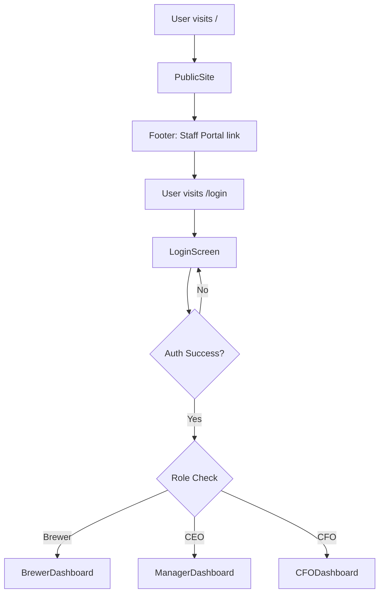
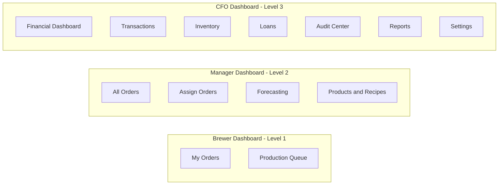
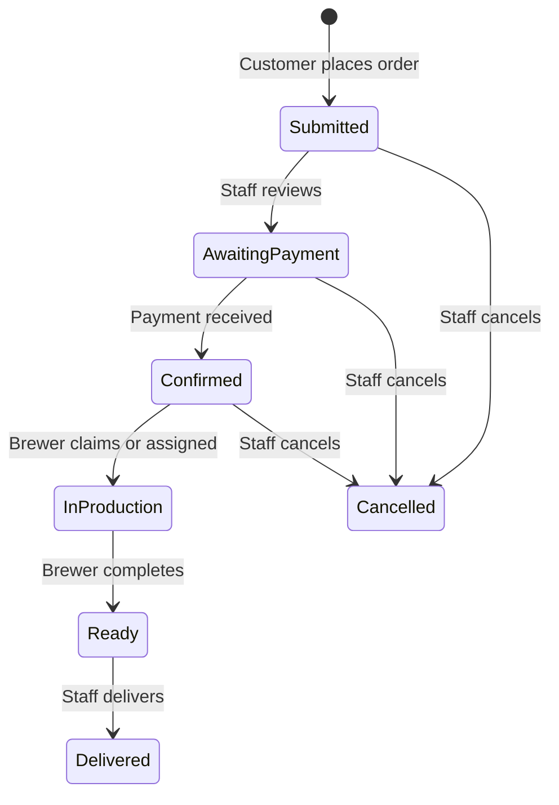
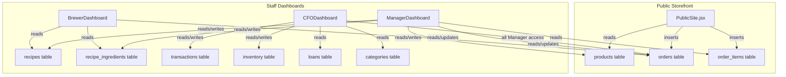

# Green Bastards Brewery — Business Platform Expansion Plan

## Overview

Expand the existing React + Supabase financial portal into a full business management platform with:
- Public-facing customer storefront
- Order management system
- Recipe/production system
- Expanded role-based staff dashboards (Brewer → Manager/CEO → CFO)

---

## Current State Analysis

### Existing Tech Stack
- **React 19** (Vite 7, no React Router installed)
- **Supabase** (Postgres + custom auth via `accounts` table with plaintext passwords)
- **Recharts 3.7** for charts
- **Monolithic `App.jsx`** (~1400 lines, all components inline)
- **Styling**: Inline styles, dark theme, `#c8a820` gold accents, Georgia serif

### Existing Database Tables
| Table | Purpose |
|-------|---------|
| `accounts` | Staff login (username/password/position) |
| `categories` | Transaction category types (Revenue/Expense/Asset/Liability/Equity) |
| `transactions` | Financial ledger entries with audit workflow |
| `inventory` | Raw materials and finished goods tracking |
| `loans` | Outstanding loan records |

### Existing Roles
| Position | Access |
|----------|--------|
| `CFO` | Full access including Audit Center |
| `CEO` | Everything except Audit Center |

### Existing Pages (all in App.jsx)
- LoginScreen, Dashboard, Transactions, Inventory, Loans, AuditCenter, Reports, Settings

---

## Architecture Plan

### New File Structure

```
src/
├── App.jsx                          # Router shell + auth context
├── supabaseClient.js                # Unchanged
├── helpers.js                       # Extracted: buildChartData, calcSummary, fmt, etc.
├── components/
│   ├── shared/
│   │   ├── StatCard.jsx
│   │   ├── ReportComponents.jsx     # Row, TotalRow, SectionHeader, MDASection
│   │   └── CustomTooltip.jsx
│   ├── LoginScreen.jsx              # Extracted + restyled
│   └── Sidebar.jsx                  # Configurable role-based sidebar
├── pages/
│   ├── public/
│   │   └── PublicSite.jsx           # Full storefront (Hero, About, Menu, Order, Footer)
│   ├── financial/
│   │   ├── Dashboard.jsx            # Existing financial overview
│   │   ├── Transactions.jsx         # Existing transaction log
│   │   ├── AuditCenter.jsx          # Existing CFO audit queue
│   │   ├── Reports.jsx              # Existing financial reports
│   │   ├── Inventory.jsx            # Existing inventory management
│   │   ├── Loans.jsx                # Existing loans page
│   │   └── Settings.jsx             # Existing settings
│   ├── orders/
│   │   └── OrdersPage.jsx           # Shared order management (Manager + CFO)
│   ├── production/
│   │   ├── ForecastingPage.jsx      # Shopping list, pipeline, revenue charts
│   │   └── ProductsRecipesAdmin.jsx # Product/recipe CRUD
│   └── dashboards/
│       ├── BrewerDashboard.jsx      # My Orders + Production Queue
│       ├── ManagerDashboard.jsx     # Extends Brewer + Orders + Forecasting + Products
│       └── CFODashboard.jsx         # Extends Manager + full financial portal
```

### Routing Strategy

Install `react-router-dom` v6. Routes:

```
/              → PublicSite.jsx (no auth)
/login         → LoginScreen.jsx (no auth)
/dashboard     → Role-gated dashboard shell
```

The `/dashboard` route checks the logged-in user's role and renders the appropriate dashboard component. Each dashboard manages its own sidebar navigation internally using local state (matching the existing pattern).



### Role Hierarchy & Gating

```
Role Level Map:
  Brewer = 1
  CEO    = 2  (displayed as Manager/CEO)
  CFO    = 3
```

Each higher role inherits all pages from lower roles. If a user somehow navigates to a page above their role level, silently redirect to their dashboard root.

### Dashboard Composition



---

## Database Migration

### New Tables

#### `products` — Public menu items
```sql
create table products (
  id uuid primary key default gen_random_uuid(),
  name text not null,
  description text,
  price numeric(10,2) not null,
  in_stock boolean default true,
  stock_qty integer default 0,
  image_url text,
  created_at timestamptz default now()
);
```

#### `recipes` — Production instructions per product
```sql
create table recipes (
  id uuid primary key default gen_random_uuid(),
  product_id uuid references products(id) on delete cascade,
  difficulty integer,
  cooking_time text,
  distill_runs integer,
  age_requirement text,
  barrel_type text,
  notes text,
  created_at timestamptz default now()
);
```

#### `recipe_ingredients` — Ingredients per recipe
```sql
create table recipe_ingredients (
  id uuid primary key default gen_random_uuid(),
  recipe_id uuid references recipes(id) on delete cascade,
  ingredient_name text not null,
  quantity integer not null,
  unit text default 'x'
);
```

#### `orders` — Customer orders with lifecycle
```sql
create table orders (
  id uuid primary key default gen_random_uuid(),
  customer_ic_name text not null,
  customer_discord text,
  delivery_method text check (delivery_method in ('Pickup', 'Delivery')),
  delivery_location text,
  status text default 'Submitted' check (status in (
    'Submitted', 'Awaiting Payment', 'Confirmed',
    'In Production', 'Ready', 'Delivered', 'Cancelled'
  )),
  payment_confirmed boolean default false,
  total_cost numeric(10,2),
  notes text,
  assigned_to text,
  status_updated_at timestamptz default now(),
  created_at timestamptz default now()
);
```

#### `order_items` — Line items per order
```sql
create table order_items (
  id uuid primary key default gen_random_uuid(),
  order_id uuid references orders(id) on delete cascade,
  product_id uuid references products(id),
  product_name text,
  quantity integer not null,
  unit_price numeric(10,2),
  subtotal numeric(10,2)
);
```

### Schema Modifications
- Add `status_updated_at` field to `orders` (included in table definition above)
- Add sample Brewer account to `accounts` table for testing

### Order Status Lifecycle



---

## Component Specifications

### PublicSite.jsx — Public Storefront

Single-page scrollable experience with anchor navigation:

| Section | Data Source | Interactivity |
|---------|-----------|---------------|
| Hero | Static | CTA buttons scroll to Menu/Order |
| About | Static | None |
| Menu | `products` table | Filter toggle for available only |
| Order Form | `products` table (in-stock) | Quantity selectors, live total, form submission |
| Footer | Static | Staff Portal link to /login |

**Key behaviors:**
- Menu cards show name, description, price, stock badge
- Out of stock items greyed with Unavailable badge
- Order form shows running total, inserts to `orders` + `order_items`
- Confirmation screen with order ID after submission
- Mobile-readable layout

### BrewerDashboard.jsx

**Sidebar nav:** My Orders, Production Queue

**My Orders:**
- Cards for orders assigned to logged-in brewer
- Expandable cards reveal recipe breakdown per item
- Ingredient quantities scaled by order quantity
- Can move orders: `In Production` → `Ready`
- Claim Order button on unassigned confirmed orders

**Production Queue:**
- Read-only list of all `In Production` orders across all brewers

### OrdersPage.jsx — Shared Order Management

Used by ManagerDashboard and CFODashboard with props controlling feature visibility.

**Features:**
- Full order table: ID, Customer, Items, Total, Status, Assigned To, Date
- Expandable rows with recipe breakdown
- Status update through full lifecycle (Manager+)
- Mark Payment Confirmed toggle
- Cancel with required reason
- Filter by status

**CFO additions (via props):**
- Financial Impact panel: delivered revenue this month, pending revenue
- Auto-generate transaction button from delivered orders

### ForecastingPage.jsx

Three sub-views:

1. **Shopping List** — Aggregates ingredients across Confirmed + In Production orders, sums quantities, copy-to-clipboard
2. **Order Pipeline** — Kanban-style columns by status with order counts and total values per stage
3. **Revenue Forecasting** — Bar chart of orders by day (30 days), guaranteed vs potential revenue totals

### ProductsRecipesAdmin.jsx

Two tabs:

1. **Products** — Table with inline edit (price, description, stock qty, in_stock toggle), add new, delete with warning
2. **Recipes** — Per-product recipe cards, edit form with dynamic ingredient rows, formatted display matching in-game format

### CFODashboard.jsx

Sidebar includes all Manager items plus:
- Financial Dashboard, Transactions, Inventory, Loans, Audit Center, Reports, Settings

All existing financial components imported from `src/pages/financial/` unchanged.

---

## Data Flow Diagram



---

## Implementation Phases

### Phase 1: Foundation
1. Create SQL migration file for all new tables
2. Install `react-router-dom` v6
3. Extract helpers from `App.jsx` into `src/helpers.js`
4. Extract shared UI components into `src/components/shared/`
5. Extract existing pages into `src/pages/financial/`

### Phase 2: Routing & Auth
6. Extract LoginScreen into component
7. Create configurable Sidebar component
8. Rewrite `App.jsx` with React Router and auth context

### Phase 3: Public Storefront
9. Build `PublicSite.jsx` with all five sections

### Phase 4: Order & Production System
10. Build `OrdersPage.jsx` with full lifecycle management
11. Build `ProductsRecipesAdmin.jsx`
12. Build `ForecastingPage.jsx`

### Phase 5: Role-Based Dashboards
13. Build `BrewerDashboard.jsx`
14. Build `ManagerDashboard.jsx`
15. Build `CFODashboard.jsx` with Financial Impact panel

### Phase 6: Polish
16. Implement role-gating and redirects
17. Verify existing financial functionality preserved
18. Mobile responsiveness for public storefront

---

## Key Design Decisions

1. **React Router v6** over custom state-based routing — provides proper URL handling, browser back/forward, and clean separation of public vs authenticated routes
2. **Dashboard-internal sidebar navigation** — each dashboard component manages its own active page state, keeping the existing UX pattern while supporting role-based menus
3. **Shared OrdersPage component** — Manager and CFO both use the same component with feature flags controlled via props, avoiding duplication
4. **`on delete cascade`** on FK relationships — cleaning up recipes when products are deleted, ingredients when recipes are deleted, order items when orders are deleted
5. **No RLS changes** — the current app does not use Supabase RLS policies; maintaining consistency (public storefront reads products and inserts orders through the anon key)
6. **Inline styles maintained** — no CSS framework introduction, matching the existing aesthetic exactly
